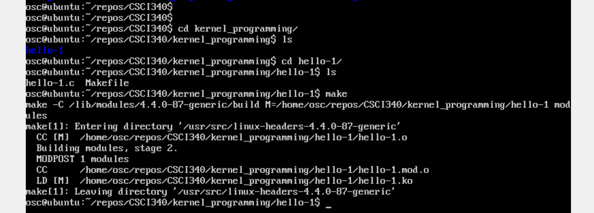

# Kernel Programming
The kernel programming needs you to be an admistrator of the computer. So the lab will not work. Please try to:
- use your own computer if it has a linux operating system.
- install virtual box by following the instruction from [HERE](http://cs.westminstercollege.edu/~greg/osc10e/vm/index.html)  
Briefly, what you should do for installing the virtual machine is:  
- install virtual box 
- install the OSC10e.ova (It is about 2GB, make sure you have enough space)

# How to get ready:  
## login to your computer and go to the terminal
- If you have ubuntu os based computer, go to your terminal 
- If you are using the virtual machine, login to your virtual machine. I will talk about how to login to your virtual machine


Since I believe most students will not have a ubuntu computer at hand, the following instruction will be based on the virtual machine. If you are using Ubuntu, the steps should be the same. The only difference may be: The OSC ubuntu provided by the textbook owner is Ubuntu 16.04. What you have might be some latest version such as Ubuntu 18.04.  

## How to login your virtual machine 
### ssh  
ssh to your local virtual machine
```
ssh -p 2222 osc@127.0.0.1
```
### regular login the virtual machine  
You will go to the terminal and you can find something like this  
[virtual machine login](./vm.png)

## Congratulations  
If you move to this step, it means you have a fully controlled Ubuntu 16.04 machine available. The password is "osc". You can do something such as install htop ... 
```
sudo apt install htop
```
Now let's move to the kernel programming.  
## get the github repo
```
git clone https://github.com/liketheflower/CSCI340.git
```
go to the kernel_programming/hello-1  
you will see two files:hello-1.c  Makefile.

## compile and run your hello world code  
```
make
```
Then you will see 

List the files by 
```
ls
```

Then you will see    

Insert module into the running kernel by using the insmod command with sudo. Recall your password is 'osc'   
```
sudo insmod hello-1.ko
head /proc/modules
```
The modules are maintained in the /proc/modules file. If you open the head by using the head command, you will see that module hello_1 is added.
Then you will see 
You can also remove the module by using 'rmmod' command
```
sudo rmmod hello_1
```
Any output generated by the printk -function will appear in the file /var/log/messages . The best command to watch this output is
```
tail /var/log/syslog
```
You can find hello world and byebye world are printed.


# Tutorial   
[tutorial 1](https://www.tldp.org/LDP/lkmpg/2.6/lkmpg.pdf)   
[tutorial 2](https://code.freedombone.net/bashrc/LKMPG/src/master/older_versions/4.12.12)  
[tutorial 3](https://www.cs.bham.ac.uk/~exr/teaching/lectures/systems/07_08/kernelProgramming.php)

